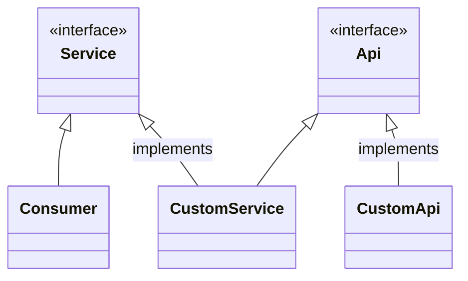

# ioc-service-container

[](https://sonarcloud.io/dashboard?id=ioc-service-container)
[](https://sonarcloud.io/dashboard?id=ioc-service-container)
[](https://sonarcloud.io/dashboard?id=ioc-service-container)
[](https://sonarcloud.io/dashboard?id=ioc-service-container)
[](https://sonarcloud.io/dashboard?id=ioc-service-container)


This is a lightweight library for a service container written in TypeScript.

<a href="https://www.buymeacoffee.com/Mrcwbr" target="_blank">
  
</a>

## Get started

Install the dependency with `npm install ioc-service-container
`

## Usage

First set up an Enum for preventing typos or redefinition of service ids in a file called `ServiceIds.ts`:

```typescript
export enum ServiceId {
  TestApi = 'TestApi',
  TestService = 'TestService',
  FooApi = 'FooApi',
}
```

According to this you have to pass a factory of your required services to the ioc container. So at the initial script of
your application you call a function named e.g. `setupService`:

```typescript
import { ServiceContainer } from 'ioc-service-container';

function setupService() {
  ServiceContainer.set(ServiceId.TestApi, CustomTestApi); // setup by class reference
  ServiceContainer.set(ServiceId.FooApi, () => new CustomFooApi()); // setup by custom factory
  ServiceContainer.set(ServiceId.Xyz, () => 'xyz');
}
```

Now you have two options to inject the requested service. The first one is without the usage of TypeScript annotations.
This can be used anywhere in your code:

### Assign service to a var

```typescript
import { scg, ServiceContainer } from 'ioc-service-container';

const testService = ServiceContainer.get<TestService>(ServiceId.TestService);
const testService1 = scg<TestService>(ServiceId.TestService); // scg is a shortcut for ServiceContainer.get()
```

#### Full TypeScript Support without generics

As you can see in the example above it's very unsexy to assign a service to a constant. You have to write 3
times `testService` (constant's name, generic & ServiceId). You are able to improve the typings by adding following
content in your `ServiceIds.ts` file :

```typescript
export enum ServiceId {
  TestApi = 'TestApi',
  // ...
}

declare module 'ioc-service-container' {
  export function scg<T extends keyof ServiceIdMap, U extends ServiceIdMap[T]>(id: T): U;

  type ServiceIdMap = {
    [ServiceId.TestApi]: TestApi,
  }
}
```

If you now use `const a = scg(ServiceId.TestApi)`, `a` is correctly typed.

### Inject service via typescript decorator

The second option is to use the `@inject` decorator inside a class:

```typescript
export class CustomTestService implements TestService {
  @inject
  private readonly customApi!: Api; // Important is the naming of the property, its mapped to the serice id

  @inject(ServiceId.FooApi) // If you don't want to name your property like the service id, use this decorator
  private readonly nameThisHowYouWant!: Api;

  private readonly barApi = ServiceContainer.get<Api>(ServiceId.BarApi) // Use this syntax if you don't want to use decorators
}
```

Your can see a demo in the `./example` folder. To run this type in `npm run example`.

## Background

Structuring your code and avoiding implizit dependencies is two of the most effective ways to avoiding bugs, especially
when code gets extended. To goal of Dependency Injection (DI) is to prevent structures like this:

```javascript
class CustomService {
  constructor() {
    this.api = new CustomApi();
  }
}
```

The `CustomService` has an implizit dependency to the `CustomApi`.

## Goal

The goal of DI is to encapsulate the dependencies of a class. The CustomService should work without knowing which api it
is using. The following structure should be created:

